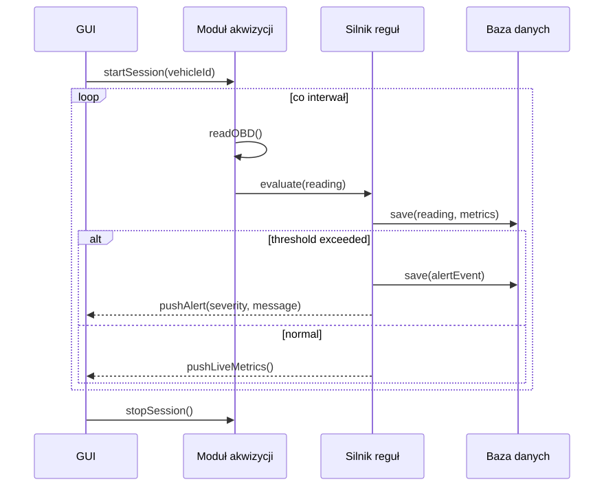

# Specyfikacja funkcjonalna
## Projekt: Monitorowanie parametrów pojazdu

## 1. Cel i zakres
System służy do monitorowania, gromadzenia i analizy parametrów pracy pojazdu (m.in. temperatura, obroty, ciśnienie wtrysku, napięcie ładowania), zasilanych przez interfejs OBD i dodatkowe czujniki. Dane są utrwalane w bazie danych i udostępniane przez interfejs graficzny.

Zakres obejmuje:
- akwizycję danych z OBD/czujników,
- walidację i normalizację,
- przechowywanie danych surowych i agregatów,
- analizę online i historyczną,
- prezentację wyników i alertowanie.

## 2. Klient, użytkownicy końcowi i interesariusze

### 2.1 Klient
- **Klient projektu:** prowadzący przedmiot / jednostka dydaktyczna (ocena zgodności z wymaganiami kursu).

### 2.2 Użytkownicy końcowi
- **Kierowca / właściciel pojazdu** – podgląd stanu auta i ostrzeżeń.
- **Mechanik / diagnosta** – analiza trendów, diagnostyka usterek, historia parametrów.
- **Operator floty (opcjonalnie)** – porównywanie pojazdów i monitorowanie stanu eksploatacji.

### 2.3 Pozostali interesariusze
- **Zespół projektowy** – implementacja i utrzymanie.
- **Administrator systemu** – konfiguracja, backup, dostępność.
- **Producent adaptera OBD / czujników** – kompatybilność interfejsów i protokołów.
- **Instytucje regulacyjne (pośrednio)** – wymagania dot. ochrony danych i bezpieczeństwa.

## 3. Kontekst biznesowy i potrzeby
- Wczesne wykrywanie nieprawidłowości pracy podzespołów.
- Obniżenie kosztów serwisowania przez diagnostykę predykcyjną.
- Usprawnienie decyzji serwisowych dzięki historii i trendom.
- Czytelna prezentacja stanu technicznego dla użytkownika nietechnicznego.

## 4. Założenia i ograniczenia
- Dane OBD są dostępne przez zgodny adapter (np. ELM327).
- Częstotliwość odczytu jest konfigurowalna i zależna od możliwości ECU.
- System działa lokalnie lub w sieci lokalnej (wariant podstawowy).
- Wersja projektowa nie realizuje homologacji ani certyfikacji automotive.

## 5. Wymagania funkcjonalne (FR)

| ID | Wymaganie | Priorytet | Kryterium akceptacji |
|---|---|---|---|
| FR-01 | System umożliwia utworzenie sesji monitoringu dla wybranego pojazdu. | Wysoki | Użytkownik rozpoczyna i kończy sesję, a status jest widoczny w GUI. |
| FR-02 | System odczytuje parametry OBD (RPM, temperatura cieczy, MAP/MAF, napięcie). | Wysoki | Dla aktywnej sesji pojawiają się próbki OBD z timestampem. |
| FR-03 | System integruje dodatkowe czujniki (np. temp. oleju) przez moduł wejściowy. | Średni | Parametry spoza OBD są widoczne i oznaczone źródłem. |
| FR-04 | System waliduje dane wejściowe (zakresy, kompletność, spójność jednostek). | Wysoki | Błędne próbki są odrzucane lub flagowane z kodem przyczyny. |
| FR-05 | System normalizuje dane do wspólnego modelu domenowego. | Wysoki | Dane z różnych źródeł mają jednolitą strukturę i jednostki. |
| FR-06 | System zapisuje dane surowe i agregaty w bazie danych. | Wysoki | Po sesji dane są dostępne historycznie i filtrowalne. |
| FR-07 | System wizualizuje dane w czasie rzeczywistym (wykresy + wartości). | Wysoki | GUI odświeża widok parametrów bez ręcznego przeładowania. |
| FR-08 | System generuje alerty na podstawie reguł progowych i trendowych. | Wysoki | Przekroczenie progu powoduje alert z poziomem ważności. |
| FR-09 | System umożliwia analizę historyczną (zakres czasu, porównanie sesji). | Średni | Użytkownik może porównać min. 2 sesje na wspólnych metrykach. |
| FR-10 | System udostępnia listę i szczegóły kodów DTC (jeśli dostępne). | Średni | DTC są prezentowane z opisem i czasem wykrycia. |
| FR-11 | System umożliwia eksport wyników sesji (CSV/JSON). | Średni | Eksport zawiera parametry, czas, statusy alertów. |
| FR-12 | System udostępnia API do pobierania danych i agregatów. | Średni | Endpointy zwracają dane zgodnie z kontraktem i filtrowaniem. |
| FR-13 | System prowadzi dziennik zdarzeń operacyjnych i błędów. | Wysoki | Log zawiera znaczniki czasu, poziom i źródło zdarzenia. |

## 6. Wymagania niefunkcjonalne (NFR)

| ID | Kategoria | Wymaganie |
|---|---|---|
| NFR-01 | Wydajność | Opóźnienie prezentacji danych live nie przekracza 2 s dla standardowego obciążenia. |
| NFR-02 | Wydajność | System obsługuje min. 20 parametrów monitorowanych równolegle na sesję. |
| NFR-03 | Niezawodność | Utrata pojedynczej próbki nie przerywa sesji; system kontynuuje zbieranie danych. |
| NFR-04 | Dostępność | Po restarcie usługi dane historyczne pozostają spójne i dostępne. |
| NFR-05 | Bezpieczeństwo | Dostęp do GUI/API wymaga uwierzytelnienia i autoryzacji ról. |
| NFR-06 | Bezpieczeństwo | Transmisja klient-serwer odbywa się po TLS (dla wdrożeń sieciowych). |
| NFR-07 | Użyteczność | Interfejs umożliwia odczyt najważniejszych parametrów bez konfiguracji zaawansowanej. |
| NFR-08 | Utrzymanie | Logika akwizycji, analizy i prezentacji jest rozdzielona modułowo. |
| NFR-09 | Obserwowalność | System publikuje metryki techniczne (czas odczytu, błędy parsera, kolejki). |
| NFR-10 | Przenośność | System może działać na Windows/Linux (warstwa aplikacji). |
| NFR-11 | Integralność danych | Każda próbka posiada timestamp, źródło i identyfikator sesji. |
| NFR-12 | Skalowalność | Architektura umożliwia rozszerzenie do wielu pojazdów bez zmiany modelu danych. |

## 7. Scenariusze użycia

### UC-01: Uruchomienie monitorowania pojazdu
- **Aktor główny:** kierowca
- **Warunki wstępne:** dostępny adapter OBD, użytkownik zalogowany
- **Przebieg główny:**
1. Użytkownik wybiera pojazd i uruchamia sesję.
2. System inicjalizuje połączenie OBD i czujniki dodatkowe.
3. System rozpoczyna cykliczne odczyty i zapis do bazy.
4. GUI prezentuje dane live i status sesji.
- **Alternatywy/błędy:** brak połączenia OBD -> komunikat, próba ponowienia, sesja w stanie „degraded”.
- **Warunki końcowe:** sesja zakończona i zapisana.

### UC-02: Obsługa alertu przegrzania
- **Aktor główny:** kierowca / mechanik
- **Warunki wstępne:** aktywna sesja, zdefiniowana reguła alertu
- **Przebieg główny:**
1. Temperatura przekracza próg.
2. System generuje alert z priorytetem.
3. GUI pokazuje ostrzeżenie i zalecenie reakcji.
4. Zdarzenie trafia do historii.
- **Warunki końcowe:** alert potwierdzony lub wygaszony po powrocie do normy.

### UC-03: Analiza historyczna sesji
- **Aktor główny:** mechanik
- **Warunki wstępne:** istnieją zapisane sesje
- **Przebieg główny:**
1. Użytkownik wybiera zakres czasu i sesje.
2. System ładuje dane i agregaty.
3. GUI przedstawia wykresy porównawcze i listę zdarzeń.
4. Użytkownik eksportuje raport CSV/JSON.
- **Warunki końcowe:** raport zapisany, decyzja serwisowa udokumentowana.

## 8. Specyfikacja interfejsów (skrót)

### 8.1 Interfejs OBD
- Wejście: ramki OBD/PID + timestamp.
- Wyjście: znormalizowane pomiary `SensorReading`.
- Błędy: timeout, nieobsługiwany PID, CRC/format.

### 8.2 API aplikacyjne
- `GET /sessions`
- `GET /sessions/{id}/readings`
- `GET /sessions/{id}/alerts`
- `GET /vehicles/{id}/metrics?from=&to=`
- `POST /sessions/{id}/export`

## 9. Diagramy UML / modelowanie (Mermaid)

### 9.1 Diagram komponentów

  

### 9.2 Diagram klas

  

### 9.3 Diagram aktywności

  

### 9.4 Diagram sekwencji (scenariusz alertu)

  

### 9.5 Diagram wdrożenia (dodatkowy)

  

